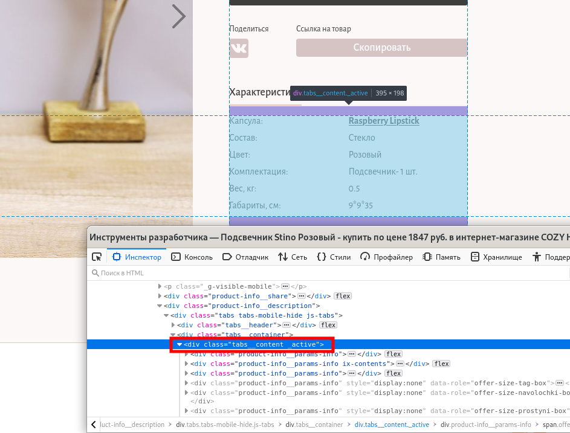
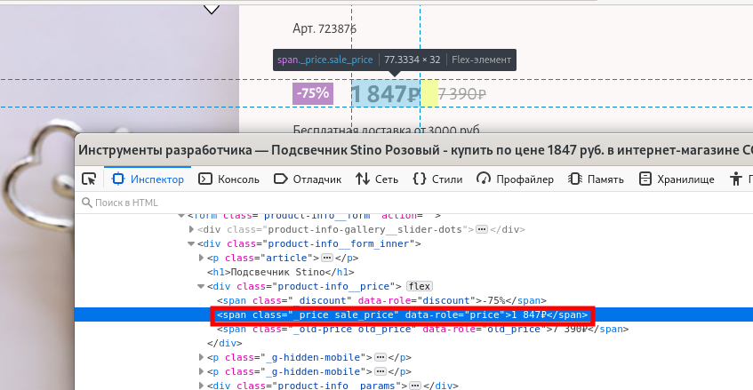
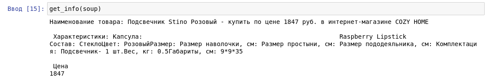

<h1>Парсер Requests + BeautifulSoup</h1>

*[Requests](https://pypi.org/project/requests/) + [BeautifulSoup](https://pypi.org/project/requests/)* - быстро легко и “При использовании этой библиотеки одновременно с библиотекой Requests для отправки HTTP-запросов разрабатывать парсеры становится гораздо проще, чем при использовании Scrapy или PySpider.” Можно с помощью методов получать нужные элементы страницы, есть возможность искать по атрибутам. (на данный момент самый популярный по мнению моих знакомых и Артура Сапрыкина:))

<h3>Для чего request?</h3>
 В метод .get библиотеки requests передается ссылка (так же можно передать прокси) для получаения html страницы. 
`response = requests.get(url, headers=headers, allow_redirects=True, proxies=proxies)`   `page_text = response.text` 
Краулер собирает во всех элементах `` страницы ссылки из атрибута `href`, переходим по этим ссылкам и аналогично собираем ссылки там и так до тех пор, пока ссылки не начнут повторяться.
 
<h3>Для чего BeautifulSoup?</h3>
BeautifulSoup позволяет получать текст из html страницы с помощью селекторов. Необходимо лишь создать экземпляр класса `soup = BeautifulSoup(page_text)`
и обращаться к методам класса. В данном случае нам нужны селекторы Характеристик и Цены.

<h3>Как получить интересующий нас текст при помощи BeautifulSoup?</h3>

 *Рис.1 Как получить селектор Характеристик* 

 *Рис.2 Как получить селектор Цены* 

Для получения текста характеристик в метод .find BeautifulSoup передается селектор `"div", class_="tabs__content _active"` как видно из первого изображения.
Чтобы получить цену аналогичным способом передается селектор `"span", class_="_price sale_price"` (см. второе изображение).
Наименование можно получить универсальным способом просто считывая title страницы, т.к. в большинстве случаев у интернет магазинов title полностья соотвествует названию товара.

<h3>Результат</h3>

 на примере https://cozyhome.ru/product/stino_723876#offer_109345
 Мы можем получить интересующий нас чистый текст без тегов, который можно обработать и использовать.

Плюсы:
- быстрота
- легкость в использовании
- очень подробная документация BeautifulSoup-а

Минусы:
- для использования парсера на другом интерент-магазине надо изменить селекторы

Надо доделать:
- обработку текста Характеристик
- прокси (т.к. Леруа не хочет парситься)
- ну и все красиво завернуть